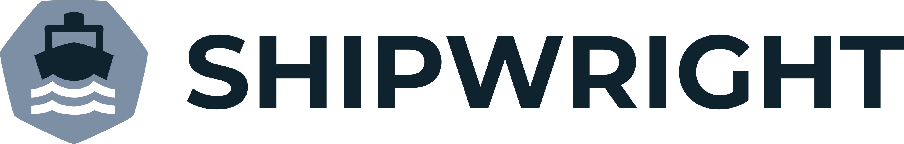

<!--
Copyright The Shipwright Contributors

SPDX-License-Identifier: Apache-2.0
-->

<p align="center">
    
    <a alt="GoReport" href="https://goreportcard.com/report/github.com/shipwright-io/build"></a>
    <a href="https://github.com/shipwright-io/build/blob/main/LICENSE"></a>
    <a href="https://pkg.go.dev/mod/github.com/shipwright-io/build"></a>
    <a href="https://bestpractices.coreinfrastructure.org/projects/5315"></a>
</p>

<picture>
  <source media="(prefers-color-scheme: dark)" srcset="./.docs/shipwright-logo-darkbg-512.png">
  <source media="(prefers-color-scheme: light)" srcset="./.docs/shipwright-logo-lightbg-512.png">
  
</picture>

Shipwright is an extensible framework for building container images on Kubernetes.

## Why?

With Shipwright, developers get a simplified approach for building container images, by defining a minimal YAML that does not require
any previous knowledge of containers or container tooling. All you need is your source code in git and access to a container registry.

Shipwright supports any tool that can build container images in Kubernetes clusters, such as:

- [Kaniko](https://github.com/GoogleContainerTools/kaniko)
- [Cloud Native Buildpacks](https://buildpacks.io/)
- [BuildKit](https://github.com/moby/buildkit)
- [Buildah](https://buildah.io/)

## Try It!

- We assume you already have a Kubernetes cluster (v1.27+). If you don't, you can use [KinD](https://kind.sigs.k8s.io), which you can install by running [`./hack/install-kind.sh`](./hack/install-kind.sh).

- We also require a Tekton installation (v0.50.+). To install it, run:

  ```bash
  kubectl apply --filename https://storage.googleapis.com/tekton-releases/pipeline/previous/v0.50.5/release.yaml
  ```

  If you are using OpenShift cluster refer [Running on OpenShift](#running-on-openshift) for some more configurations.

- Install the Shipwright deployment. To install the latest version, run:

  ```bash
  kubectl apply --filename https://github.com/shipwright-io/build/releases/download/v0.13.0/release.yaml --server-side
  curl --silent --location https://raw.githubusercontent.com/shipwright-io/build/v0.12.0/hack/setup-webhook-cert.sh | bash
  ```

  To install the latest nightly release, run:

  ```bash
  kubectl apply --filename "https://github.com/shipwright-io/build/releases/download/nightly/nightly-$(curl --silent --location https://github.com/shipwright-io/build/releases/download/nightly/latest.txt).yaml" --server-side
  curl --silent --location https://raw.githubusercontent.com/shipwright-io/build/main/hack/setup-webhook-cert.sh | bash
  ```

- Install the Shipwright strategies. To install the latest version, run:

  ```bash
  kubectl apply --filename https://github.com/shipwright-io/build/releases/download/v0.13.0/sample-strategies.yaml --server-side
  ```

  To install the latest nightly release, run:

  ```bash
  kubectl apply --filename "https://github.com/shipwright-io/build/releases/download/nightly/nightly-$(curl --silent --location https://github.com/shipwright-io/build/releases/download/nightly/latest.txt)-sample-strategies.yaml" --server-side
  ```

- Generate a secret to access your container registry, such as one on [Docker Hub](https://hub.docker.com/) or [Quay.io](https://quay.io/):

  ```bash
  REGISTRY_SERVER=https://index.docker.io/v1/ REGISTRY_USER=<your_registry_user> REGISTRY_PASSWORD=<your_registry_password>
  kubectl create secret docker-registry push-secret \
      --docker-server=$REGISTRY_SERVER \
      --docker-username=$REGISTRY_USER \
      --docker-password=$REGISTRY_PASSWORD  \
      --docker-email=<your_email>
  ```

- Create a *Build* object, replacing `<REGISTRY_ORG>` with the registry username your `push-secret` secret have access to:

  ```bash
  REGISTRY_ORG=<your_registry_org>
  cat <<EOF | kubectl apply -f -
  apiVersion: shipwright.io/v1beta1
  kind: Build
  metadata:
    name: buildpack-nodejs-build
  spec:
    source:
      type: Git
      git:
        url: https://github.com/shipwright-io/sample-nodejs
      contextDir: source-build
    strategy:
      name: buildpacks-v3
      kind: ClusterBuildStrategy
    output:
      image: docker.io/${REGISTRY_ORG}/sample-nodejs:latest
      pushSecret: push-secret
  EOF
  ```

  To view the *Build* which you just created:

  ```bash
  $ kubectl get builds
 
  NAME                     REGISTERED   REASON      BUILDSTRATEGYKIND      BUILDSTRATEGYNAME   CREATIONTIME
  buildpack-nodejs-build   True         Succeeded   ClusterBuildStrategy   buildpacks-v3       68s
  ```  

- Submit your *BuildRun*:

  ```bash
  cat <<EOF | kubectl create -f -
  apiVersion: shipwright.io/v1beta1
  kind: BuildRun
  metadata:
    generateName: buildpack-nodejs-buildrun-
  spec:
    build:
      name: buildpack-nodejs-build
  EOF
  ```

- Wait until your *BuildRun* is completed and then you can view it as follows:

  ```bash
  $ kubectl get buildruns
  
  NAME                              SUCCEEDED   REASON      STARTTIME   COMPLETIONTIME
  buildpack-nodejs-buildrun-xyzds   True        Succeeded   69s         2s
  ```

  or

  ```bash
  kubectl get buildrun --output name | xargs kubectl wait --for=condition=Succeeded --timeout=180s
  ```

- After your *BuildRun* is completed, check your container registry, you will find the new generated image uploaded there.

### Running on OpenShift

If you are running on OpenShift and if the `pipeline` service account isn't already created,
here are the steps to create the same:

```sh
oc create serviceaccount pipeline
oc adm policy add-scc-to-user privileged -z pipeline
oc adm policy add-role-to-user edit -z pipeline
```

## Please tell us more!

Depending on your source code, you might want to build it differently with Shipwright.

To find out more on what's the best strategy or what else can Shipwright do for you, please visit our [tutorial](./docs/tutorials/README.md)!

## More information

### Read the Docs

| Version | Docs                           | Examples                    |
| ------- | ------------------------------ | --------------------------- |
| HEAD    | [Docs @ HEAD](docs/README.md) | [Examples @ HEAD](samples) |
| [v0.13.0](https://github.com/shipwright-io/build/releases/tag/v0.13.0)    | [Docs @ v0.13.0](https://github.com/shipwright-io/build/tree/v0.13.0/docs) | [Examples @ v0.13.0](https://github.com/shipwright-io/build/tree/v0.13.0/samples) |
| [v0.12.0](https://github.com/shipwright-io/build/releases/tag/v0.12.0)    | [Docs @ v0.12.0](https://github.com/shipwright-io/build/tree/v0.12.0/docs) | [Examples @ v0.12.0](https://github.com/shipwright-io/build/tree/v0.12.0/samples) |
| [v0.11.0](https://github.com/shipwright-io/build/releases/tag/v0.11.0)    | [Docs @ v0.11.0](https://github.com/shipwright-io/build/tree/v0.11.0/docs) | [Examples @ v0.11.0](https://github.com/shipwright-io/build/tree/v0.11.0/samples) |
| [v0.10.0](https://github.com/shipwright-io/build/releases/tag/v0.10.0)    | [Docs @ v0.10.0](https://github.com/shipwright-io/build/tree/v0.10.0/docs) | [Examples @ v0.10.0](https://github.com/shipwright-io/build/tree/v0.10.0/samples) |
| [v0.9.0](https://github.com/shipwright-io/build/releases/tag/v0.9.0)    | [Docs @ v0.9.0](https://github.com/shipwright-io/build/tree/v0.9.0/docs) | [Examples @ v0.9.0](https://github.com/shipwright-io/build/tree/v0.9.0/samples) |
| [v0.8.0](https://github.com/shipwright-io/build/releases/tag/v0.8.0)    | [Docs @ v0.8.0](https://github.com/shipwright-io/build/tree/v0.8.0/docs) | [Examples @ v0.8.0](https://github.com/shipwright-io/build/tree/v0.8.0/samples) |
| [v0.7.0](https://github.com/shipwright-io/build/releases/tag/v0.7.0)    | [Docs @ v0.7.0](https://github.com/shipwright-io/build/tree/v0.7.0/docs) | [Examples @ v0.7.0](https://github.com/shipwright-io/build/tree/v0.7.0/samples) |
| [v0.6.0](https://github.com/shipwright-io/build/releases/tag/v0.6.0)    | [Docs @ v0.6.0](https://github.com/shipwright-io/build/tree/v0.6.0/docs) | [Examples @ v0.6.0](https://github.com/shipwright-io/build/tree/v0.6.0/samples) |
| [v0.5.1](https://github.com/shipwright-io/build/releases/tag/v0.5.1)    | [Docs @ v0.5.1](https://github.com/shipwright-io/build/tree/v0.5.1/docs) | [Examples @ v0.5.1](https://github.com/shipwright-io/build/tree/v0.5.1/samples) |
| [v0.5.0](https://github.com/shipwright-io/build/releases/tag/v0.5.0)    | [Docs @ v0.5.0](https://github.com/shipwright-io/build/tree/v0.5.0/docs) | [Examples @ v0.5.0](https://github.com/shipwright-io/build/tree/v0.5.0/samples) |
| [v0.4.0](https://github.com/shipwright-io/build/releases/tag/v0.4.0)    | [Docs @ v0.4.0](https://github.com/shipwright-io/build/tree/v0.4.0/docs) | [Examples @ v0.4.0](https://github.com/shipwright-io/build/tree/v0.4.0/samples) |
| [v0.3.0](https://github.com/shipwright-io/build/releases/tag/v0.3.0)    | [Docs @ v0.3.0](https://github.com/shipwright-io/build/tree/v0.3.0/docs) | [Examples @ v0.3.0](https://github.com/shipwright-io/build/tree/v0.3.0/samples) |
| [v0.2.0](https://github.com/shipwright-io/build/releases/tag/v0.2.0)    | [Docs @ v0.2.0](https://github.com/shipwright-io/build/tree/v0.2.0/docs) | [Examples @ v0.2.0](https://github.com/shipwright-io/build/tree/v0.2.0/samples) |
| [v0.1.1](https://github.com/shipwright-io/build/releases/tag/v0.1.1)    | [Docs @ v0.1.1](https://github.com/shipwright-io/build/tree/v0.1.1/docs) | [Examples @ v0.1.1](https://github.com/shipwright-io/build/tree/v0.1.1/samples) |
| [v0.1.0](https://github.com/shipwright-io/build/releases/tag/v0.1.0)    | [Docs @ v0.1.0](https://github.com/shipwright-io/build/tree/v0.1.0/docs) | [Examples @ v0.1.0](https://github.com/shipwright-io/build/tree/v0.1.0/samples) |

### Dependencies

| Dependency                           | Supported versions           |
| -------------------------------------| ---------------------------- |
| [Kubernetes](https://kubernetes.io/) | v1.27.\*, v1.28.\*, v1.29.\* |
| [Tekton](https://tekton.dev)         | v0.50.\*, v0.53.\*, v0.56.\* |

### Platform support

We are building container images of the Shipwright Build controller for all platforms supported by the base image that we are using which is [registry.access.redhat.com/ubi9/ubi-minimal](https://catalog.redhat.com/software/containers/ubi9/ubi-minimal/615bd9b4075b022acc111bf5). Those are:

- linux/amd64
- linux/arm64
- linux/ppc64le
- linux/s390x

All these platforms are also supported by our Tekton Pipelines dependency. Our own tests as part of our CI pipeline are all only running on and testing the linux/amd64 platform.

Our sample build strategies are all functional on linux/amd64. Their support on other platforms relies on the tools being used there to be available for other platforms. For detailed information, please see [Available ClusterBuildStrategies](docs/buildstrategies.md#available-clusterbuildstrategies).

## Want to get involved?

### Community meetings

We host weekly meetings for users, contributors, maintainers and anyone interested in the project. The weekly meetings take place on Mondays at 1pm UTC.

- Meeting [minutes](https://github.com/shipwright-io/community/issues?q=is%3Aissue+label%3Acommunity+label%3Ameeting)
- Public calendar [invite](https://calendar.google.com/calendar/u/0/embed?src=shipwright-admin@lists.shipwright.io&ctz=America/New_York)

### Want to contribute

We are so excited to have you!

- See [CONTRIBUTING.md](https://github.com/shipwright-io/.github/blob/main/CONTRIBUTING.md) for an overview of our processes
- See [DEVELOPMENT.md](DEVELOPMENT.md) for how to get started
- See [HACK.md](HACK.md) for how to build, test & run
  (advanced reading material)
- Look at our
  [good first issues](https://github.com/shipwright-io/build/issues?q=is%3Aissue+is%3Aopen+label%3A%22good+first+issue%22)
  and our
  [help wanted issues](https://github.com/shipwright-io/build/issues?q=is%3Aissue+is%3Aopen+label%3A%22help+wanted%22)
- Contact us:
  - Kubernetes Slack: [#shipwright](https://kubernetes.slack.com/messages/shipwright)
  - Users can discuss help, feature requests, or potential bugs at [shipwright-users@lists.shipwright.io](https://lists.shipwright.io/archives/list/shipwright-users@lists.shipwright.io/).
  Click [here](https://lists.shipwright.io/admin/lists/shipwright-users.lists.shipwright.io/) to join.
  - Contributors can discuss active development topics at [shipwright-dev@lists.shipwright.io](https://lists.shipwright.io/archives/list/shipwright-dev@lists.shipwright.io/).
  Click [here](https://lists.shipwright.io/admin/lists/shipwright-dev.lists.shipwright.io/) to join.
