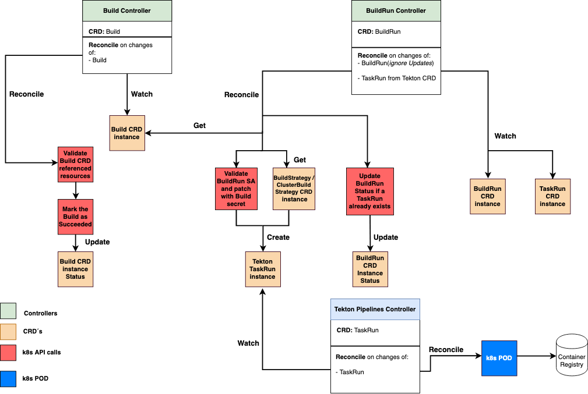

<!--
Copyright The Shipwright Contributors

SPDX-License-Identifier: Apache-2.0
-->

# Build Controllers

Build or codenamed **build-v2** is an API open-source implementation that build container-images on Kubernetes from a _dockerfile-based_ or a _source-based_ approach.

The whole idea of **Build** is to hide the details of image construction from an application developer, by defining [Custom Resources](https://kubernetes.io/docs/concepts/extend-kubernetes/api-extension/custom-resources/) that the **Build** understands.

Through the **Build** CRD´s the user can specify a desired popular strategy, like **source-to-image**, **buildpack-v3**, **kaniko**, **jib** and **buildah**, in order to build an image.

From a high-level perspective:

- [`Build`](build.md) hosts the user provide information. This defines the strategy, source input and the desired output(_e.g. container registry_).
- [`BuildRun`](buildrun.md) hosts the details of an image construction, abstracting this from the user and taking advantage of the Tekton Pipelines task to build the image.
- [`BuildStrategy`](buildstrategies.md) hosts a list of steps to execute in the Tekton Task definition during the **BuildRun** execution.
- [`ClusterBuildStrategy`](buildstrategies.md) similar to the **BuildStrategy** but it is _cluster-scoped_.

## Learn more

See the following docs referencing each of the Kubernetes resources currently supported:

- [`Build`](build.md)
- [`BuildRun`](buildrun.md)
- [`BuildStrategy`](buildstrategies.md)
- [`ClusterBuildStrategy`](buildstrategies.md)

## Migrating to the beta API

The `shipwright.io/v1beta1` API is the current storage version. If you still have Custom Resources
using `shipwright.io/v1alpha1`, see [Migrating from v1alpha1 to v1beta1](migrating-v1alpha1-to-v1beta1.md)
for the complete field mapping.

## Controllers Flow

The following image illustrate the interactions between the `Build`, `BuildRun` controller and the Tekton `Pipeline` controller.

